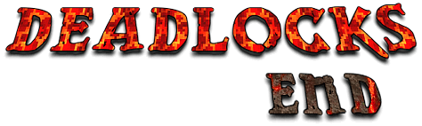
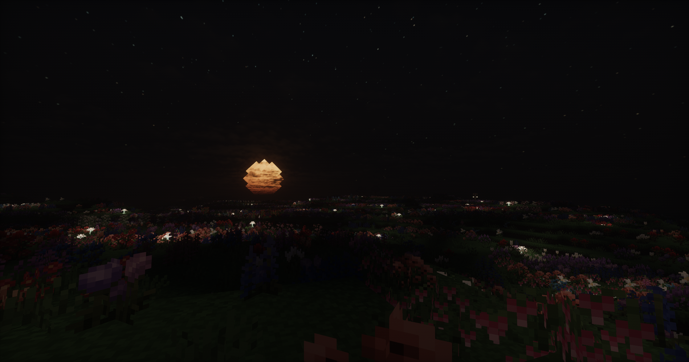
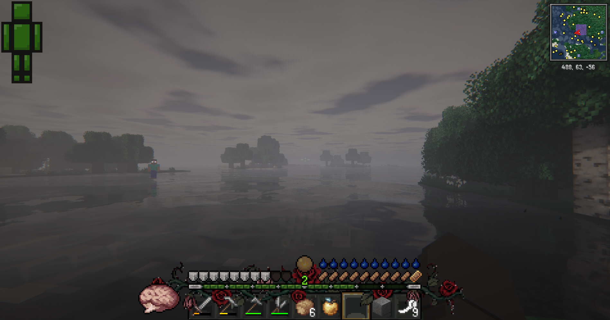
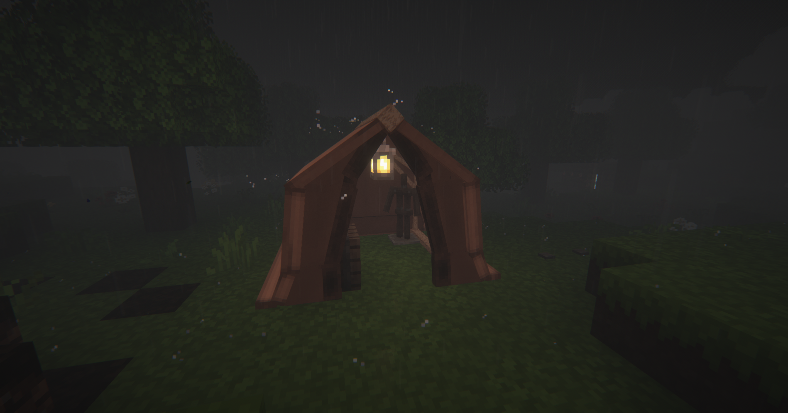
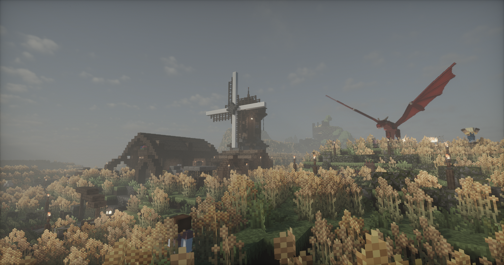
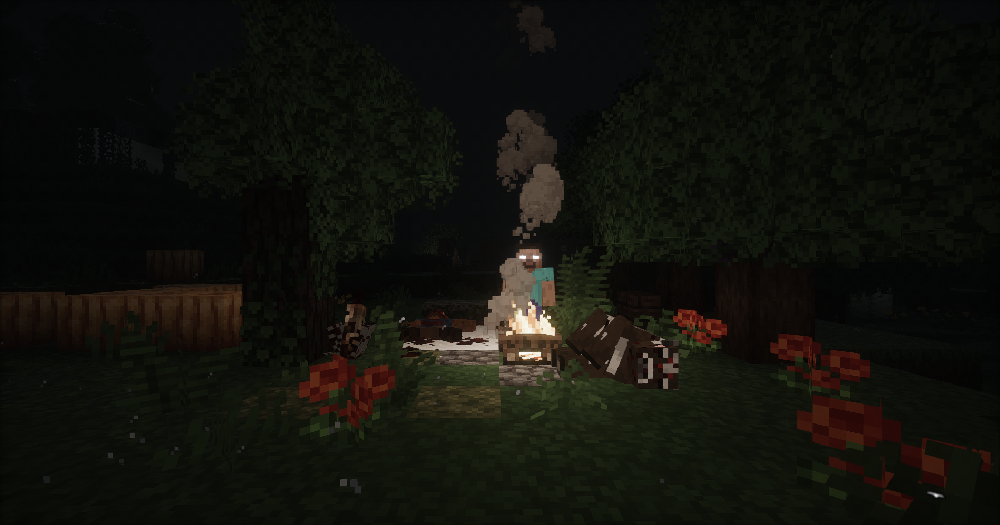

  

  
  
  
  
  

> **The world did not end all at once.**
>
> It withered itself shut, one long winter at a time.
 
## About

**Deadlocks End** is a dark survival modpack built around slow progression, harsh environments, body-part damage, primitive crafting, and the constant feeling that the world is waiting for you to make a mistake.

The trees will not give themselves to your fists.  
The night will not wait for you to prepare.  
Your body will not forgive carelessness.

Every tool, every bandage, every drink of clean water is a reward of its own.

## Core Experience

Deadlocks End focuses on making early survival feel dangerous, deliberate, and atmospheric.

Expect:

- Primitive survival progression
- No early-game tree punching
- Body-part based damage and healing
- Temperature and thirst management
- Spooky questlines with survival-horror flavor
- Harsh nights and hostile encounters
- Low-power starts with meaningful upgrades
- A world that feels hostile before it feels familiar

## Early Game Progression

### Day One: The Long Dusk

The first day is about learning that the old rules no longer apply.

You will scavenge sticks, flint, plant fiber, and loose stone before earning your first _crude_ tools. Things like No Tree Punching changes the feeling of survival, forcing you to work with the ground before the forest gives you anything useful.

By nightfall, your goal is simple:

**Make fire before you get caught in the dark.**

### Day Two: The Body Keeps Score

Day Two focuses on recovery, warmth, water, and preparation. First Aid becomes pretty essential as wounds need plaster and bandages instead of simple passive regen. Mods like Tough As Nails push you to manage the cold, gather wool, purify water, and craft armor that keeps your body from failing before the monsters even arrive.

You are still very fragile.

Now you are just fragile with a... _plan_?

## Featured Systems

### Primitive Crafting

Early progression is slower and more grounded. Flint shards, plant string, loose rocks, and crude tools form the foundation of your survival.

### Body-Part Damage

With **First Aid**, damage is no longer just a single health bar. Specific body parts can be injured, forcing you to treat wounds before they become fatal.

### Temperature and Thirst

**Tough As Nails** makes the environment a threat. Cold, heat, thirst, and poor preparation can kill as easily as any monster.

### Survival Gear

Craft leaf armor, wool armor, canteens, bandages, plaster, copper tools, and other early survival equipment to push deeper into the world.

### Horror Atmosphere

The quest book is written to feel like a survivor’s journal slowly turning into a warning.

### Time

Over time the modpack will likely get harder as I implement more features, update configs, and wall off more tools using reskillable 😊

## Screenshots

> Replace these placeholders with images from your pack.

| The Long Dusk | The Body Keeps Score |
| --- | --- |
|  |  |

| Campfire Shelter | Run while you still can |
| --- | --- |
|  |  |

| Something in the Dark |
| --- |
|  |

## Installation

Deadlocks End is built for:

- **Minecraft:** 1.20.1
- **Mod Loader:** Forge
- **Forge Version:** 47.4.10
- **Primary Host:** CurseForge
- **Mod Source:** CurseForge

### CurseForge App

Deadlocks End is intended to be installed through CurseForge.

1. Open the CurseForge app.
2. Search for **Deadlocks End**.
3. Install the latest release.
4. Launch the profile through CurseForge.

The pack is built around **Minecraft 1.20.1** and **Forge 47.4.10**.

### Manual / Third-Party Launchers

Manual installation is not the main distribution method.

Every mod included in Deadlocks End is sourced from CurseForge. If you import the pack into another launcher, make sure the launcher can correctly resolve and download CurseForge-hosted mods.

Do not redistribute the mod `.jar` files outside CurseForge unless each mod author’s license explicitly allows it.

## Credits

Deadlocks End is built on the work of many Minecraft mod developers.

Every mod included in this pack is sourced from **CurseForge**, and all credit for individual mods belongs to their respective authors.

Please support the original mod authors by downloading the pack through CurseForge.

## Development Status

Deadlocks End is currently in development for **Minecraft 1.20.1** on **Forge 47.4.10**.

Questlines, balance, recipes, rewards, monster encounters, and world generation may change as the pack grows.

Current focus:

- Day One questline
- Day Two questline
- Early survival balance
- Medical progression
- Temperature and thirst pacing
- Horror atmosphere
- Screenshot and release polish

## License

This repository contains configuration files, quest files, scripts, and documentation for the Deadlocks End modpack.

Individual mods are owned and licensed by their respective creators.

Deadlocks End is intended to be distributed through **CurseForge**, with mods downloaded from their official CurseForge project pages.

Do not redistribute third-party mod files outside CurseForge unless allowed by the original mod authors.

## Final Note

The end is not coming.

It already happened.

Now you are just walking through what it left behind.
